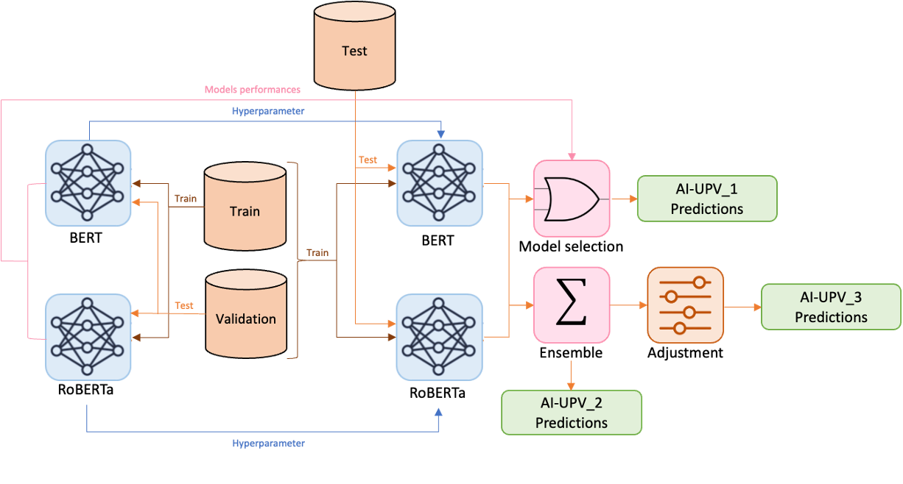

# AI-UPV at EXIST 2023 -- Sexism Characterization Using Large Language Models Under The Learning with Disagreements Regime




# Description
This repository contains the code for the paper **Sexism Characterization Using Large Language Models Under The Learning with Disagreements Regime**, where we describe our participation in the third sEXism Identification in Social neTworks (EXIST) Challenge. This paper was accepted by the 14th Conference and Labs of the Evaluation Forum (CLEF). Descriptions of the implementation and the dataset are contained in the [paper](https://arxiv.org/pdf/2307.03385.pdf).

# Paper Abstract
With the increasing influence of social media platforms, it has become crucial to develop automated systems capable of detecting instances of sexism and other disrespectful and hateful behaviors to promote a more inclusive and respectful online environment. Nevertheless, these tasks are considerably challenging considering different hate categories and the author's intentions, especially under the learning with disagreements regime. This paper describes AI-UPV team's participation in the EXIST (sEXism Identification in Social neTworks) Lab at CLEF 2023. The proposed approach aims at addressing the task of sexism identification and characterization under the learning with disagreements paradigm by training directly from the data with disagreements, without using any aggregated label. Yet, performances considering both soft and hard evaluations are reported. The proposed system uses large language models (i.e., mBERT and XLM-RoBERTa) and ensemble strategies for sexism identification and classification in English and Spanish. In particular, our system is articulated in three different pipelines. The ensemble approach outperformed the individual large language models obtaining the best performances both adopting a soft and a hard label evaluation. This work describes the participation in all the three EXIST tasks, considering a soft evaluation, it obtained fourth place in Task 2 at EXIST and first place in Task 3, with the highest ICM-Soft of -2.32 and a normalized ICM-Soft of 0.79. The source code of our approaches is publicly available at https://github.com/AngelFelipeMP/Sexism-LLM-Learning-With-Disagreement.


# Cite
If you find this article [article](https://arxiv.org/pdf/2307.03385.pdf) or the [code](https://github.com/AngelFelipeMP/Sexism-LLM-Learning-With-Disagreement) useful in your research, please cite us as: 


```
@inproceedings{depaula2023exist, 
title={AI-UPV at EXIST 2023 -- Sexism Characterization Using Large Language Models Under The Learning with Disagreements Regime}, 
author={de Paula, Angel Felipe Magnossão and Rizzi, Giulia and Fersini, Elisabetta and Spina, Damiano}, 
booktitle={sEXism Identification in Social neTworks (EXIST) Lab at the 14th Conference and Labs of the Evaluation Forum (CLEF)}, 
year={2023}, 
organization={CLEF},
location={Thessaloniki, Greece}
}

```


# Credits
EXIST 2023 shared Task Organizers

EXIST 2023 proceedings: (link coming soon)

Task website: http://nlp.uned.es/exist2023/

Contact: jcalbornoz@lsi.uned
